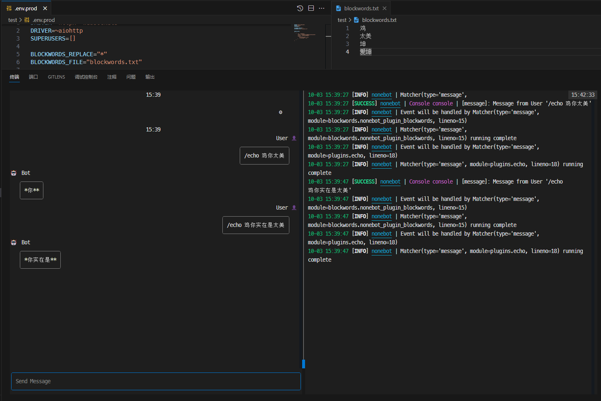

# 聊天屏蔽词插件

聊天屏蔽词插件是所有`adapter`的通用的插件，可以对用户发送的词进行检测然后进行自定义操作，例如屏蔽词中加入一些辱骂词汇，检测到辱骂词汇时进行撤回或者禁言等操作，也可以对机器人发送的进行检测，如果存在屏蔽词进行拦截发送或者替换屏蔽词。

- [聊天屏蔽词插件](#聊天屏蔽词插件)
  - [如何添加屏蔽词](#如何添加屏蔽词)
  - [机器人发送的消息进行屏蔽词检测](#机器人发送的消息进行屏蔽词检测)
    - [将机器人发送的屏蔽词进行替换](#将机器人发送的屏蔽词进行替换)
  - [接收用户消息屏蔽词检测](#接收用户消息屏蔽词检测)

## 如何添加屏蔽词

1. 配置`env`中的`blockwords`配置项例如

   ```env
   blockwords=["鸡", "垃圾", "废物"]
   ```

2. 通过导入文件的方式可以配置`env`中的`blockwords_file`

   ```env
   blockwords_file="blockwords.txt"
   ```

3. 多文件导入方式

   ```env
   blockwords_file=["blockwords1.txt", "blockwords2.txt"]
   ```

## 机器人发送的消息进行屏蔽词检测

在`env`中配置`blockwords_bot`开启`bot`发送消息检测

```env
blockwords_bot = True  # 开启后机器人发送的消息会被进行检测
```


> 上述例子中，因为检测到机器人发送的消息存在屏蔽词，插件会拦截机器人发送的消息，如果不希望进行拦截，可以查看如何[将机器人发送的屏蔽词进行替换](#将机器人发送的屏蔽词进行替换)

### 将机器人发送的屏蔽词进行替换

在`env`中配置`blockwords_replace`配置项，以下是`blockwords_replace`配置项使用例子。

```env
BLOCKWORDS_REPLACE="*" # 将屏蔽词替换为*
```



## 接收用户消息屏蔽词检测

在`env`中配置`blockwords_user`开启接收用户所发送的消息进行检测

```env
blockwords_user = True  # 开启后机器人发送的消息会被进行检测
```

在检测到屏蔽词时会触发到`blockwords_matcher`，可以导入`blockwords_matcher`对触发屏蔽词后进行自定义操作

```python
from nonebot.internal.matcher import Matcher
from nonebot_plugin_blockwords import blockwords_matcher

@blockwords_matcher.handle()
async def _(matcher: Matcher):
    await matcher.finish("不许说脏话")
```


