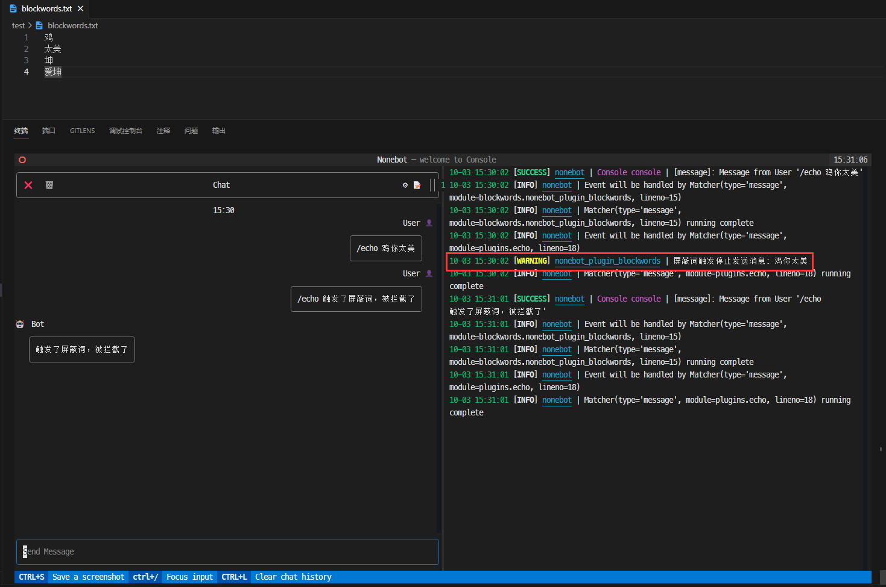
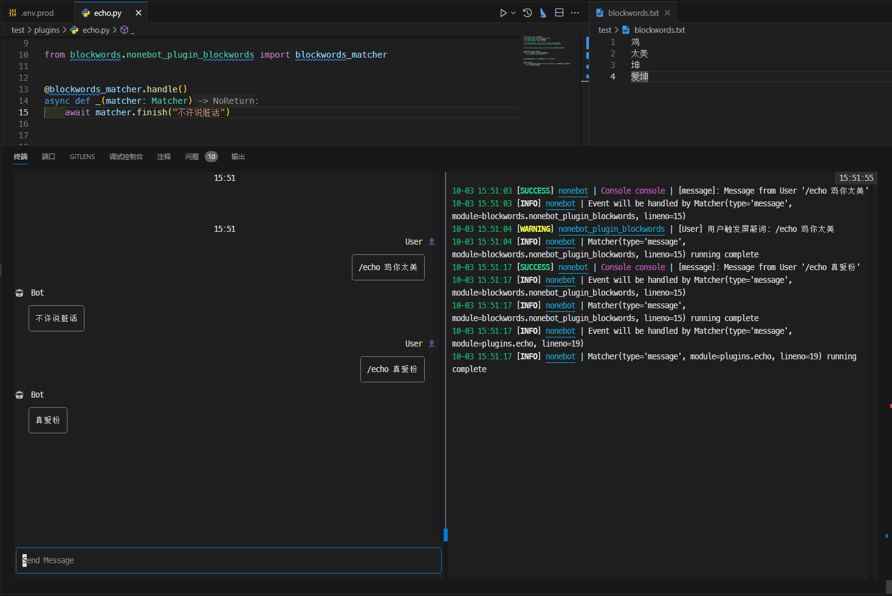

# 聊天屏蔽词插件

## 使用例子

在使用时先确定需要在`env`中配置开启哪个或者全部开启

```env
blockwords_bot = True  # 开启后机器人发送的文本消息会被进行检查
blockwords_user = False  # 关闭这个配置将不会检查用户发送的消息
```

然后可以通过在`env`中修改配置屏蔽词，可选择配置`blockwords`或者配置`blockwords_file`

### `blockwords`添加屏蔽词

```env
blockwords=["鸡", "垃圾", "废物"]
```

### `blockwords_file`添加屏蔽词文件（确保文件存在）

```env
blockwords_file="blockwords.txt"
```

```env
blockwords_file=["blockwords1.txt", "blockwords2.txt"]
```

接下来我们将使用`console`进行演示，我会将屏蔽词都写入到一个`blockwords.txt`的文件下，并且只开启`blockwords_bot`



是不是觉得很有趣，当然，你如果希望机器人发送的消息屏蔽词转成特定的字符，你可以使用`blockwords_replace`配置项，以下是`blockwords_replace`配置项使用例子。

```env
BLOCKWORDS_REPLACE="*"	# 将屏蔽词替换为*
```


### 尝试使用`blockwords_user`配置

我们在使用`blockwords_user`时可以去配置一段触发屏蔽词的代码

```python
from nonebot.internal.matcher import Matcher
from nonebot_plugin_blockwords import blockwords_matcher

@blockwords_matcher.handle()
async def _(matcher: Matcher):
    await matcher.finish("不许说脏话")
```


